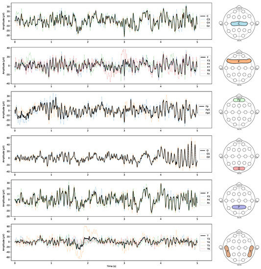
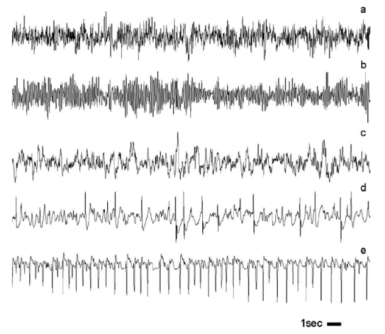
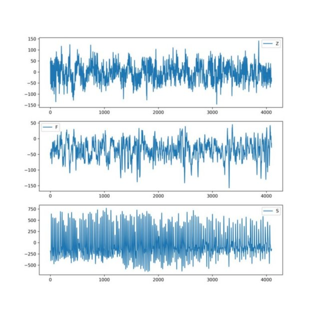

# 9章 機械学習による時系列解析

時系列解析に機械学習の手法を適応する例を見ていく。機械学習の手法は、時系列データに特化して開発されたものではないが、時系列データにも役に立つことが立証されている。

前章までの内容

- 時系列予測を生成するものとして統計モデルを説明した。
- 時系列のダイナミクス、時系列の挙動のノイズと不確実性を記述する統計学に関する、背後の理論を構築した。
- 過程について仮定したダイナミクスを元に予測を行い、予測の不確実性の度合いを推定した。
- この方法では、モデルとパラメータの特定に当たり、データのダイナミクスを説明する最良の方法を熟慮する必要がある。

本章の内容

- 時系列データの「背後にある過程」やその規則の過程を置かない手法を学ぶ
- 時系列の適切な分類ラベルなど、注目する結果の予測を過程の挙動へ関連するように説明するパターンの特定に注力する。
- 時系列クラスタリングという、時系列の教師なし学習についても考察する。

## 9.1 時系列の分類

脳波 (ElectroEncephaloGram, EEG) の時系列データから特徴量を抽出し、決定木を使って EEG データを分類する。

### 9.1.1 特徴量選択と生成

前章で説明した cesium パッケージを使って特徴量を生成する。

> cesium: Machine Learning Time-Series Platform 
https://cesium-ml.org/

cesium パッケージには有用な時系列データセットが付属する。その一つのEEG時系列データを使う。

> Module: datasets
https://cesium-ml.org/docs/api/cesium.datasets.html

次はEEGのデータセットをロードするコードです。

```python
from cesium import datasets
eeg = datasets.fetch_andrzejak()

eeg.keys()
dict_keys(['times', 'measurements', 'classes', 'archive', 'header'])
np.unique(eeg['classes'])
array(['F', 'N', 'O', 'S', 'Z'], dtype='<U1')
len(eeg["measurements"])
500
len(eeg["measurements"][0])
4097
```

EEG時系列データは、健康な人とてんかん患者が、異なる活動をしている際に脳のいろいろな部分の脳波を測定した連続測定値から切り出した同じ長さのセグメントである[1]。

脳波は測定する場所によって脳波は図１のように異なる。

> 
> 図 1. Representation of the EEG TS of a random patient during the mental task [2]

EEG時系列データは、５つのカテゴリのデータセットからなる[1]。

- 健康な人の、両目を開けておよび両目を閉じて観測した記録 (２つのカテゴリ、ZとO)  
- てんかん患者の、無発作時の、発作と無関係な脳の２つの箇所を測定した記録（２つのカテゴリ、NとF）
- てんかん患者の、発作時の頭蓋内の記録（１つのカテゴリ、S）

それぞれのカテゴリの脳波の例を図2に示す。

> 
> 図 2. Exemplary EEG time serieIMAGES/from each of the five sets. [1]

まず、分析するデータを幾つか眺めておくと、時系列データをどのように分類したいかを考えるのに役に立つ。

```python
plt.subplot(3, 1, 1)
plt.plot(eeg["measurements"][0])
plt.legend(eeg['classes'][0])
plt.subplot(3, 1, 2)
plt.plot(eeg["measurements"][300])
plt.legend(eeg['classes'][300])
plt.subplot(3, 1, 3)
plt.plot(eeg["measurements"][450])
plt.legend(eeg['classes'][450])
```

> 
> 図9-1 EEG時系列データのサンプル

図9-1のEEGのグラフから次の知見が得られる。

- カテゴリZとFは、カテゴリSに比べてデータの歪度が小さい。
- 各カテゴリでは、値の範囲がかなり異なる。振幅の特徴量が役に立ちそう。
- 各カテゴリでは、点の全体的な分布の特徴が異なる。

> #### 可視化と機械学習の出会い
>
> - **2次元ヒストグラム**：全カテゴリの時系列を１枚の画像に合成するので、特徴量が各カテゴリの元データを代表するかしないかを確認できる。
> - **カーネル密度推定**： データの背後にある変数の分布やノンパラメトリックな推定に変換する。

cesiumモジュールの次のメソッドを使って特徴量を生成する。

> **cesium.featurize.featurize_time_series**
https://cesium-ml.org/docs/api/cesium.featurize.html#cesium.featurize.featurize_time_series
  Versatile feature generation function for one or more time series.

```python
from cesium import featurize as ft
features_to_use = ["amplitude",
                  "percent_beyond_1_std",
                  "percent_close_to_median",
                  "skew",
                  "max_slope"]

fset_cesium = ft.featurize_time_series(times=eeg["times"],
                  values=eeg["measurements"],
                  errors=None,
                  features_to_use=features_to_use,
                  scheduler = None)

fset_cesium['percent_beyond_1_std'][0]
0.327313
```

| 特徴量 | 意味 |
|:---|:---|
| amplitude                  | 振幅 |
| percent_beyond_1_std       | 平均値±標準偏差の外側のデータのパーセント |
| percent_close_to_median    | 中央値に近い (振幅の0.2倍の範囲)データのパーセント |
| skew                       | 歪度 |
| max_slope                  | 最大勾配 |

正規化されていない特徴量は、正規化された値を使う技法の場合には注意する必要がある。

生成された特徴量が自分が理解している値と同じかを確認しておきましょう。次は、１つの時系列サンプルに対してpercent_beyond_1_stdを検証するコードです。

```python
eeg_std   = np.std(eeg["measurements"][0])
eeg_mean  = np.mean(eeg["measurements"][0])
sample_ts = eeg["measurements"][0]
sz = len(sample_ts)
ll = eeg_mean - eeg_std
ul = eeg_mean + eeg_std
quals = [i for i in range(sz) if sample_ts[i] < ll or sample_ts[i] > ul]
print(len(quals)/sz)
0.3273126678057115
```

自分が使用する特徴量は検証できるようにすべきである。これは責任ある分析の問題です。自分で理解し説明し検証できない情報を自分のアルゴリズムへ渡すべきではない。

cesiumのサイトには、EEG時系列データから特徴量を抽出し、RandomForestClassifierを使って分類するJupyter Notebookのコードが紹介されている。利用する要約特徴量は本書籍と異なる。

> Epilepsy Detection Using EEG Data
> http://cesium-ml.org/docs/auto_examples/plot_EEG_Example.html

> #### 特徴量はエルゴード的であるべき
> 時系列の特徴量を選択する際には、生成した特徴量が**エルゴード的**であることを確認しましょう。
> - エルゴード的とは、同じ過程から収集されるデータが増えるにつれ、測定値は安定した値に収束すること。
> - ランダムウォークは、過程の平均値が特定の値に収束せず、エルゴード的ではない。
>
> EEGデータは、時系列の異なる部分サンプルが明らかに同等で、系列に弱い定常性があるため、生成した特徴量には妥当性がある。

> #### 特徴量生成ライブラリの乱用は避けよう
> - 特徴量生成プログラムを自分で書くことは難しくない。
> - 特定の特徴量の組合せを繰り返し生成する場合、最適化が可能なので自分でプログラムを書くべきである。
> - 例えば、時系列の平均値を使う特徴量が複数ある場合、特徴量ごとに平均値を計算するのではなく、全体で１度だけ平均値を計算するようにプログラムを書くことができる。

### 9.1.2 決定木手法

時系列データの解析には決定木手法を使うことが多い。それは、人間が時系列データを分析するとき、決定木のように振る舞う例が多くあるためだ。

- トレーダーが株式市場でテクニカル指標を使用するとき、まず、あるテクニカル指標のモメンタムの方向を把握し、次にボラティリティの時間変化を確認する。２つ質問と答えの対応は木のような関係になる。
- 医療従事者がEEGを分析するさい、まず、ある特徴量の存在を探し、次に別の特徴量を考慮するように、一連の要因を順次取り組んでいく。

EEGデータより生成した特徴量だけを使って、ランダムフォレストと勾配ブースティング木の異なる決定木手法で分類する。

ランダムフォレストは、時系列予測より時系列分類の方が成功を収めやすい。一方、勾配ブースティング木は分類・予測ともに概ねうまくできる。

### 9.1.2.1 ランダムフォレスト

ランダムフォレストは、複数の決定木の出力を平均した結果を使用して分類・回帰を行う。それぞれの決定木は、入力データとその特徴量のランダムなサンプルを使って構築された単純な木で、その結果として過剰適合を防ぐことができる。訓練する木の個数と木の最大の深さはハイパーパラメータとして構築時に指定する。

#### 生の時系列データを入力とする場合の問題点

- 長さの異なる時系列を扱うのは手間がかかる。
- 入力の数が非常に大きい（タイムステップ数に等しいか近い）と、計算的に高価なモデルと訓練となる。
- 特定のタイムステップが特に重要でないと仮定すると（任意のどのタイプステップもいずれかの特徴量と関係があるので）、各タイムステップを入力とする木の視点から見ると、ノイズが非常に多く訓練に使えるシグナルが少ない。

#### 要約特徴量をランダムフォレストで使う

ランダムフォレストは、生の時系列データを扱うにはあまりよいツールではないが、要約特徴量へ圧縮されたなら次の理由で役に立つ。

- 効率と計算資源の観点からすれば、きわめて長い時系列から少数の特徴量を抽出して妥当な精度のモデルを見つけられる。
- ランダムフォレストによって過剰適合のリスクを減らせる。過剰適合と先読みの相乗効果によって、特に時系列解析では過剰適合が問題になる。能力の低いまたは単純な手法を使うことで、この懸念をある程度払拭できる。
- ランダムフォレストは、時系列の過程の背後にある仕組みに関する作業モデルや作業仮説がない場合に特に適切である。

### 9.1.2.2 勾配ブースティング木

ブースティングは、予測器のアンサンブルを構築するもう１つの方法で、後のモデルは前のモデルの過ちを修正し、前のモデルがうまく適合できなかったデータには、<u>後のモデルによってより大きな重みが付けられるべき（アダブースト？）</u>、という発想に基づいてモデルを順次作成する。

勾配ブースティング木は、ブースティング手法の主力で、時系列用のブースティング手法としてコンテストで格別な成功を収めている。

XGBoostは、各々が１つ前の木の集団の結合の残差を予測する木を順次構築することで機能する。

1. XGBoostが構築した１番目の木は、データに直接（カテゴリか数値に）合わせることを試みる。
2. ２番目の木は、「真の値」と「１番目の木が予測した値」との差の予測を試みる。
3. ３番目の木は、「真の値」から「１番目の木が予測した値」と「２番目の木が予測した、１番目の木の残差」を引いた残りを予測することを試みる。

<u>予測を行う場合、弱分類器のそれぞれの出力を合計した値を出力とする。</u>

#### 勾配ブースティング木の調整

1. モデルの複雑度の罰則項を含む損失関数を最小にする
2. 罰則項によって、生成される木の個数が制限される。
3. 生成される木の個数を直接的に制限することもできる。

> #### バギングとブースティング
> **バッギング** (正式な用語はブートストラップアグリゲーション) は、アンサンブル内の各モデルが使用する訓練用のデータセットをランダムにサンプリングする、モデル訓練技法を指す。ランダムフォレストは、モデルの訓練にバギング手法を使うのが一般的である。
> **ブースティング**は、順次訓練されるモデルでアンサンブルが構成され、構成する各モデルはその直前のモデルが生成した誤差の修正に焦点を当てるような、モデル訓練技法を示す。ブースティングは、勾配ブースティング木の訓練法の核となっている。

### 9.1.2.3 コード例

ランダムフォレストと勾配ブースティング木で分類するコードを見てみましょう。

まず、EEGデータセットを訓練用とテスト用のデータに分割します。

```python
X_train, X_test, y_train, y_test = train_test_split(
     fset_cesium.iloc[:, 0:5].values, eeg["classes"], random_state=21)
```

ランダムフォレストで訓練するコードは次になります。

```python
from sklearn.ensemble import RandomForestClassifier
clf = RandomForestClassifier(n_estimators=10, max_depth=3,random_state=21)
clf.fit(X_train, y_train)
```

ランダムフォレストの性能を見てみましょう。

```pyhton
clf.score(X_train, y_train)
0.6266666666666667
clf.score(X_test, y_test)
0.616
```

勾配ブースティング木で訓練するコードは次になります。

```python
model = xgb.XGBClassifier(n_estimators=10, max_depth=3, random_state=21)
model.fit(X_train, y_train)
```

勾配ブースティング木の性能を見てみましょう。

```pyhton
model.score(X_train, y_train)
0.752
model.score(X_test, y_test)
0.648
```

XGBoostの分類器モデルの方がランダムフォレストよりやや精度が高く、訓練の速度も早い。そのため、大きなデータセットを使用する場合は、速度の点で XGBoost が優位性があり、特徴量の個数がより多い場合は更に優位性が増す。

実行時間を計測するには、次のように書きます。

```pyhton
start = time.time()
xgb_clf.fit(X_train, y_train)
end = time.time()
end - start
0.0189
```

> #### 性能テストの間違ったやり方
> 前出のコードの問題点
> - もっとコンパクトに書ける。
> - 訓練時間は複数の平均をとるべきである。
> - おもちゃのデータで実行するのではなく、現実的なデータに対して検査すべきである。
> 
> 実行速度が遅いからと言って、次の理由でそのアルゴリズムが本質的に遅いわけではない。
> - アルゴリズムの性能よりもコードの透明性を優先して書かれている。
> - アルゴリズムが汎用的なケースを想定して実装されている。
> 
>自分のデータ要件が特殊な場合は、アルゴリズムの標準的な実装を自分の目的に合わせて修正できる場合もある。

> **追加説明**
>jupyter notebookでは、次のマジックコードが利用できる。
>
>```bash
> %time 式 -- 「式」を1回だけ実⾏し、処理時間を計測する
> %timeit 式 -- 「式」を複数回実⾏し、その平均の処理時間を計測する
> %%time -- セル全体の処理時間を計測する
> %%timeit -- セル全体を複数回実⾏し、その平均の処理時間を計測する
> ```

ハイパーパラメータを変更して、勾配ブースティング木とランダムフォレストの性能を比較してみましょう。

```pyhton
## 木の数は同じ (10) で複雑度が低い (max_depth = 2) 条件でテスト
## XGBoost
xgb_clf = xgb.XGBClassifier(n_estimators = 10, max_depth = 2, random_state = 21)
xgb_clf.fit(X_train, y_train)
xgb_clf.score(X_test, y_test)
0.616

## Random Forest
rf_clf = RandomForestClassifier(n_estimators = 10, max_depth = 2,random_state = 21)
rf_clf.fit(X_train, y_train)
rf_clf.score(X_test, y_test)
0.544
```

更に複雑度を下げて比較してみます。

```pyhton
## 木の数は同じ (10) で複雑度が更に低い (max_depth = 1) 条件でテスト
## XGBoost
xgb_clf = xgb.XGBClassifier(n_estimators = 10, max_depth = 1, random_state = 21)
xgb_clf.fit(X_train, y_train)
xgb_clf.score(X_test, y_test)
0.632

## Random Forest
rf_clf = RandomForestClassifier(n_estimators = 10, max_depth = 1, random_state = 21)
rf_clf.fit(X_train, y_train)
rf_clf.score(X_test, y_test)
0.376
```

#### ハイパーパラメータのチューニング

訓練速度を早くするために、ハイパーパラメータ（木の深さ、決定木の総数など）を変更して木の複雑度を低くしても、精度はランダムフォレストよりXGBoostの方が高い。

次の比較のように、XGBoostは役に立たない特徴量を却下する傾向が強いため。

- ブースティング（勾配ブースティング木）は常にすべての特徴量から意味のある特徴量を選択して活用する。
- バギング（ランダムフォレスト）で生成される一部の木ではあまり意味のない特徴量を使うことが強制される。

> #### 勾配ブースティング木のライブライの選択
> 勾配ブースティング木の実装には XGBoost以外に次のライブラリがある。大きなデータセットを扱う場合は、訓練速度の点でどれを利用するかを検討することをお勧めする。XGBoostよりも他の２つ方が速度がかなり速い場合があるが、サンプル外テストの精度がやや減少することもある。
> - LightGBM
> - CatBoost

> **追加説明**: 時系列データのサンプル内テストとサンプル外テスト
> 1990〜2013年のデータを使用してモデルを訓練し、2011〜2013年の予測を行う場合、それは**サンプル内(in-sample)テスト**です。一方、モデルの訓練に1990〜2010年のみを使用し、2011〜2013年を予測する場合は、**サンプル外(out-sample)テスト**になります。
> https://stats.stackexchange.com/questions/260899/what-is-difference-between-in-sample-and-out-of-sample-forecasts


### 9.1.2.4 分類 対 回帰

大きな時系列データセットを扱う時系列予測の場合、勾配ブースティング木を使って成果を上げた事例が増えている。
勾配ブースティング木を使う利点は、無意味だったりノイズの大きい特徴量を取り除いて重要な特徴量に絞る能力がほぼ「自動操縦」の域にあること。
しかし、この能力に頼るだけでは不十分で、高品質でよく検査された特徴量を入力として与えることが一番重要だ。

次を考慮する必要がある。

- 勾配ブースティング木を利用する場合は、時系列特徴量の準備とハイパーパラメータの調整に多くの時間をかける必要がある。
- ハイパーパラメータのグリッドサーチを行ってモデルを調整できる。
- 特徴量の重要度を示す指標によって、役に立つと判定された特徴量に絞ったり、それらの特徴量に似た特徴量を追加することもできる。
- 誤ったラベルが付けられたデータの生の時系列データを調べて、現在の特徴量の集合で表現できないものがないかを調べ、新たな特徴量を追加することができる。

### 参考文献

[1] Indications of nonlinear deterministic and finite-dimensional structures in time series of brain electrical activity, Ralph G. Andrzejakら, 2001.
https://perma.cc/YZD5-CTJF

[2] Fractal Methods and Power Spectral Density as Means to
Explore EEG Patterns in Patients Undertaking Mental Tasks, Carlos Alberto Valentimら, 2021.
https://www.mdpi.com/2504-3110/5/4/225/htm

