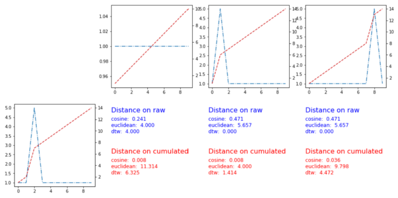

# 9章 機械学習による時系列解析

## 9.2 クラスタリング

クラスタリングの概念は、互いに類似するデータポイントは分析にとって意味のある集団を構成する、というものである。この概念は、時系列データにも他の種類のデータにも当てはまる。

時系列クラスタリングは、分類と予測の両方に使える。

- 分類の場合は、クラスタリングアルゴリズムを使って、訓練フェーズで使う望ましいクラスタの個数を特定できる。その後、このクラスタ群を使って、時系列の種類を明らかにしたり、新規のサンプルが<u>特定のグループに属する時を</u>認識できる。
- 予測の場合は、純粋なクラスタリングが目的か、関連する距離メトリクス（後述）を使うクラスタリングに触発されたものである。

#### クラスタリングを用いた時系列予測

時系列予測では、手元にある最初のNタイムステップの観測された時系列に基づきタイムステップ N + h での値を予測する。クラスタリングを使った方法には次の２つがある。

- カテゴリ所属を用いて、そのカテゴリの典型的な挙動に基づく予測を生成する。
   1. 時系列サンプルがどのクラスタに属するかを最初の N タイムステップに基づいて特定する。それは先読みを防ぐためです。
   2. カテゴリ所属に基づいて尤もらしい将来予測を推定する。
   具体的には、そのクラスタに属する時系列の値がタイプステップ N と N+h の間で変化する傾向を調べる。
- 時系列のサンプルの将来挙動を、サンプル空間の最近傍点（もしくは近傍点群）に基づいて予測する。
   1. 最初の N タイプステップで得られた指標に基づき、時系列サンプルの、完全な挙動がわかっている最近傍点（群）を見つける。
   2. 最近傍点群の N + h ステップでの挙動を平均し、それが該当サンプルの予測となる。

#### 時系列間の類似度の評価法

時系列データのクラスタリングで使われる距離メトリクスは、次の２つのクラスに分類される。

- 特徴量に基づく距離
  - 時系列の特徴を生成し、それを座標として距離を計算する。この場合は、横断面データセットの距離メトリクスと同じ問題を考慮すれば完全ではないが十分である。
- 生の時系列データに基づく距離
  - 異なる時系列がどのくらい「近い」かを判定する方法を見つける。できれば、異なる時間スケールや異なる観測数などの、時系列サンプルの間に生じがちな差異を取り除く方法が望ましい。

以降では、両方の距離メトリクスを、手書き単語の２次元画像サンプルから１次元の時系列に射影する時系列データセットに適用する。

### 9.2.1 データから特徴量を生成する

時系列データセット間の距離を特徴量の類似度に基づいて評価する。

決定木などによって評価される**特徴量の重要度**（feature_importances_変数）を使って、重要ではない特徴量を取り除き、距離計算に含めないようにする。

距離の計算にそのような特徴量を含めたくないのは、分類タスクのクラスまたは予測タスクの出力に関連する類似性が2つの時系列の間にないのに、それらの特徴量が誤った類似性を示す可能性があるためです。

#### 時系列データセット FifyWords

George Washington library 所有の歴史的文書の手書き単語の２次元画像をラベル付けする FifyWords を事例として取り上げる[1]。

[FifyWords]
(http://www.timeseriesclassification.com/description.php?Dataset=FiftyWords)

FifyWordsでは、単語の長さにかかわらず同じ測定数で構成される１次元曲線に写像する方法（**射影プロファイル**）を使って、単語の２次元画像を変換して１次元曲線へデジタル化した。

１つの文書内の類似または同一のすべての単語に単一のラベルを付けて、その後に人間が単語にデジタル的にラベル付けできるようにするのが目的である。つまり、このデータセットの各サンプルには単語の種別を示す数値（４４など）が付けられているが、それを単語へ結び付ける教師ラベル（Alexandriaなど）は付随しない。

> 現在の技術では、十分なデータがあれば、ディープラーニングの分類器を使って元の２次元画像から直接訓練できる。

```python
words = pd.read_csv('data/50words_TEST.csv', header = None)
words.rename(columns = {0:'word'}, inplace = True)
words.shape
(455, 272)
len(words['word'].unique())
50
```


射影プロファイルでは、図3のように書きの単語の左から右への進行が時系列データの時間軸に相当する。

> 
> 図3 手書き文字とその射影プロファイル [3]

図9-4を見ると、ピークの高さと位置、ピークまでの傾きの急峻さやピークのてっぺんに見られる形などの特徴量が考えられる。これらの特徴量を検討する際、時系列データというより画像データとして考えると役に立つ。

> 
> 図 9-4 異なる３つの単語の射影プロファイル同士の違いは大きい

#### 特徴量を抽出する

ピークの位置を判定する特徴量の生成は、判定プログラムに高い要求が必要なため困難である。

１次元ヒストグラムは、ピークの特定や、時系列の全体的な形状をマッピングする他の代わりの値を見つけるための計算負荷の高くない方法である。図9.5に射影プロファイルとその１次元ヒストグラムを示す。

```python
plt.subplot(3, 2, 1)
plt.plot(words.iloc[1, 1:-1])
plt.title("Sample Projection Word " + str(words.word[1]), fontweight = 'bold', y = 0.8, fontsize = 14)
plt.subplot(3, 2, 2)
plt.hist(words.iloc[1, 1:-1], 10)
plt.title("Histogram of Projection Word " + str(words.word[1]), fontweight = 'bold', y = 0.8, fontsize = 14)
plt.subplot(3, 2, 3)
plt.plot(words.iloc[3, 1:-1])
plt.title("Sample Projection Word " + str(words.word[3]), fontweight = 'bold', y = 0.8, fontsize = 14)
plt.subplot(3, 2, 4)
plt.hist(words.iloc[3, 1:-1], 10)
plt.title("Histogram of Projection Word " + str(words.word[3]), fontweight = 'bold', y = 0.8, fontsize = 14)
plt.subplot(3, 2, 5)
plt.plot(words.iloc[5, 1:-1])
plt.title("Sample Projection Word " + str(words.word[11]), fontweight = 'bold', y = 0.8, fontsize = 14)
plt.subplot(3, 2, 6)
plt.hist(words.iloc[5, 1:-1], 10)
```

> 
> 図 9-5 有用な特徴量の着想を得るために、カテゴリを測る別の方法

#### 2次元ヒストグラム

word 12 の９個の射影プロファイルを１つのグラフに描くと図４になる。

```python
w1 = words[words.word == 12]

fig = plt.figure(figsize=(15, 10))
ax = fig.subplots(1, 1)

for i in range(w1.shape[0]):
    ax.plot(w1.iloc[i, 1:271])
```

> 
> 図4 word 12 の９個の射影プロァイル

同じ単語の他の時系列と比べて、外れ値ではないことを確かめるために２次元ヒストグラムを描画し、大まかにバリエーションを確かめる。

図9-6は、図4の９つの射影プロファイルで重なっている部分が分かるように２次元ヒストグラムで描いたものである。

```python
x = np.array([])
y = np.array([])

# w = 23
w = 12
selected_words = words[words.word == w]

for idx, row in selected_words.iterrows():
    y = np.hstack([y, row[1:271]])
    x = np.hstack([x, np.array(range(270))])
    
fig = plt.figure(figsize=(15, 10))
ax = fig.subplots()
hist = ax.hist2d(x, y, bins = 50)
plt.xlabel("Time", fontsize = 18)
plt.ylabel("Value", fontsize = 18)
```

> 
> 図9-6 word 12 の2次元ヒストグラム

word 12 に関して、２次元ヒストグラムから次の特徴がわかる。

- ２つのピークがある。
- ピークの間に平坦な部分がある。
- タイプステップ50から150の間でピークのばらつきがある。

同様にword 23をプロットしたのが図5と図9-7である。<u>図9-7でヒストグラムが「ぼやけ」ている理由は、書籍ではサンプルのピークの重なる部分が少ないためと述べていますが、サンプル数が４つと少ないためです。実際は最後のピークの位置は重なっています。</u>

> 
> 図5 word 23 の４個の射影プロファイル

> 
> 図9-7 word 23 の2次元ヒストグラム

#### 特徴量の生成

以上の分析の結果、次の特徴量を使うことを決定する。

- 単語の射影プロットから導出する特徴量
  - amplitude
  - percent_beyond_1_std
  - percent_close_to_median
- 単語の射影のヒストグラムの形状から導出する特徴量
  - amplitude
  - percent_close_to_median
  - skew

```python
from cesium import featurize

features_to_use = ["amplitude",
                   "percent_beyond_1_std",
                   "percent_close_to_median",
                  ]

featurized_words = featurize.featurize_time_series(times=times,
                      values=values,
                      errors=None,
                      features_to_usefeatures_to_use,
                      scheduler =None)
```

次は、ヒストグラムのデータから特徴量を抽出するコードです。

```python
times = []
values = []
for idx, row in words_features.iterrows():
    values.append(np.histogram(row.values, bins=10, range=(-2.5, 5.0))[0] + .0001)
    times.append(np.array([i for i in range(9)]))

features_to_use = ["amplitude",
                   "percent_close_to_median",
                   "skew"
                  ]
featurized_hists = featurize.featurize_time_series(times=times,
                      values=values,
                      errors=None,
                      features_to_use=features_to_use,
                      scheduler = None)
```

２つの特徴量を結合します。

```python
features = pd.concat([featurized_words.reset_index(drop=True), featurized_hists], axis=1)
```

### 9.2.2 時間を意識する距離メトリクス

時系列間の距離メトリクスを定義して時系列間の類似度を測る。

#### 動的時間短縮法（Dynamic Time Warping、DTW）

形状を比較するために、時系列データを時間軸で揃えるように時間的に「伸縮」する手法。

単語の射影データのように、全体的な形状が最大の特徴であるような時系列クラスタリングに適している。

図9-8が示すように、時間軸（x）を伸縮して２つの曲線（２つの時系列）の形状を比較するのに最もよく揃うような点の並び方を探す。

> 
図9-8 動的時間伸縮法の仕組み

#### DTWの規則

DTWでは、次の規則に従うように２つの時系列デ ータが対応付けられる。２つのデータが同じ時間単位でなくともよい。

- 一方の時系列のすべての点は、もう一方の時系列の少なくとも１点に対応付けられる。
- 一方の時系列の最初と最後のインデックスは、もう一方の時系列の相当するインデックスに対応付けられる。
- 点の対応付けは、時間が後退するのではなく前進するように行う。つまり、時系列上で既に通過した点に遡るように対応付けはできない。しかし、常に前進する必要はなく、連続した点をもう一方の点へ凝縮することができる。

時間的な並びをこの規則に従うように調整するやり方はいくつもあるが、選択された対応付けは、曲線間の距離を最小にするものである。
この距離（またはコスト関数）は、対応付けられた点の絶対差（２点間の値の差）の和と計算されることが多い。

#### DTWのコード

DTW距離は、典型的な動的計画法の問題である。次にコードを示す。

```python
def distDTW(ts1, ts2):
    DTW       = np.full((len(ts1) + 1, len(ts2) + 1), 0, dtype = np.float32)
    DTW[:, 0] = np.inf
    DTW[0, :] = np.inf
    DTW[0, 0] = 0

    for i in range(1, len(ts1) + 1):
        for j in range(1, len(ts2) + 1):
            idx1 = i - 1 
            idx2 = j - 1
            
            dist               = (ts1[idx1] - ts2[idx2])**2
            min_preceding_dist = min(DTW[i-1, j], DTW[i, j-1], DTW[i-1, j-1])

            DTW[i, j] = dist + min_preceding_dist

    return sqrt(DTW[len(ts1), len(ts2)])
```

多数のDTWの実装法があり、近似解をより効率的に計算する様々な工夫が行われている。大きいデータセットを使う場合は、様々な実装を試してみましょう。

#### その他の時系列間の距離を測定する方法

- **フレシェ距離**
  - ２つの曲線間の距離を最小にするように時間伸縮的に曲線をたどる際の、２点間の最大距離。
  - ひもでつながられた犬と飼い主が２つの曲線上を歩く例えで説明される。両者は異なる速さで進んでも良い。
  - 犬と飼い主が最適な軌跡をたどる課題を完了するのに必要な最短なひもの長さ。
- **ピアソンの相関**
  - ２つの時系列間の相関。相関が最大になると、時系列間の距離は最小になる。
  - ２つの時系列のデータポイントの個数が同じである、またはデータポイントの個数が多い方を間引いて少ない方に合わせることが要求される。
  - 計算量は $O(n)$ で、効率が良い。
- **最長共通部分列**
  - カテゴリ値や整数の並びを表現する時系列に適した距離メトリクス。
  - ２つの時系列の類似度を最長共通部分列の長さ（連続する同じ値の長さ）で判定する。
  - DTWと同様に、時系列の長さが一致している必要はない。
  - 時系列中の位置が一致していなくともよい。DTWと同様に、共通の形状を見つけることが重視される。
- **編集距離**
  - 一方の時系列とそっくりにするために、もう一方の時系列に加えるべき変更の個数を見つけ、その値を使ってメトリクスを定義する。

> #### 距離 対 類似度
>どの時系列が似ているかまたは似ていないかを判断する際、距離と類似度という用語を入れ替えて使うことができる。フレシュ距離のように本来の距離（フィートなどの距離単位）で計算されるものもあれば、相関のように単位がないものもある。

#### 時系列の距離メトリクスはどれが適切か

クラスタリングを行うとき、図７の左下の時系列と右上の３つの時系列との類似度はどのように計算すべきか[4]。

- 形状と位置を考えると、右上２つ目が近いと思える。
- 相関、ユークリッド距離、ミンコフスキー距離、DTWではそれとは異なる結果になる。
- 計算負荷が特に高いDTWも万能ではないことが分かる。DTWは最初にピークのある時系列と最後にピークのある時系列を同じくらい近いと判断してしまう。

> 
> 図7 時系列の距離メトリクスはどれが適切か [4]

元の時系列を使って距離を計算するのではなく、図８のように、時系列の累積和（図の赤線）に対して距離を計算すると（赤字の数値）、ユークリッド距離とDTWは正しい値を返す。

> 
> 図8 時系列の累積和を使って距離を計算する [4]

> #### 時系列解析にユークリッド距離を使ってはいけない
> ユークリッド距離は時系列の距離メトリクスには適さない。
> 次の３つの時系列を比較すると、1と2のよりも1と3のユークリッド距離が近くなる。
> 1. 正弦曲線
> 1. (1)と同じ周期で振幅がより大きい正弦曲線
> 1. 水平線
> 
> 時系列の距離メトリクスでは次の能力が重要であることがわかる。
> - 比較にあまり重要でない、時間軸に沿った変位（位相）を相殺する能力
> - 大きさの類似度ではなく、形状の類似度を認識する能力
>
>**フーリエ変換**
> - ユークリッド距離が適切と判断した場合でもフーリエ変換距離を使うことを検討しよう。
> - 上限周波数を設けることで、次元削減が行えるので、高周波が重要でない時系列に適する。
>
>**記号集約近似（Symbolic Aggregate Approximation, SAX）**
> - <u>ユークリッド距離の下限を計算する前にSAXを試そう</u>。次元削減のために使える。
>
>
> 図4 Symbolic Aggregate Approximationの例 [5]

#### 時系列の距離メトリクスの選択

時系列の距離メトリクスの選択は自動ではできない。次のバランスを考えて判断する必要がある。

- 計算資源の使用を最小にする。
- 自分の最終目標にとって最も重要な時系列特徴量が強調されるメトリクスを選ぶ。
- 距離メトリクスは、それと組合わせて使う分析法の仮定と長所・短所を反映している。
- <u>例えば、k平均クラスタリング（k平均法）は、ペアワイズ距離を使わず分散を最小にするので、ユークリッド距離だけが使える。</u>

### 9.2.3 クラスタリングのプログラム

選択した特徴量またはペアワイズDTW距離行列を使ってクラスタリングを行い、両者の結果を比較する。

### 9.2.3.1 正規化した特徴量の階層的クラスタリング

単語の時系列の特徴量を正規化する。

```python
from sklearn import preprocessing

feature_values = preprocessing.scale(features.values)
```

```python
from sklearn.cluster import AgglomerativeClustering

clustering = AgglomerativeClustering(n_clusters=50, linkage='ward')
feature_clustering.fit(feature_values)
words['feature_labels'] = feature_clustering.fit_predict(p)
```

### 9.2.3.2 DTW距離行列を使った階層的クラスタリング

```python
from sklearn.metrics.pairwise import pairwise_distances
from sklearn.cluster import AgglomerativeClustering

p = pairwise_distances(X, metric = distDTW)
dtw_clustering = AgglomerativeClustering(linkage = 'average', n_clusters = 50, affinity = 'precomputed')
words['dtw_labels'] = dtw_clustering.fit_predict(p)
```

```python
from sklearn.metrics.cluster import homogeneity_score, completeness_score

homogeneity_score(words.word, words.dtw_labels) 
0.828
completeness_score(words.word, words.dtw_labels)
```

## 参考文献

[3] Word Image Matching Using Dynamic Time Warping, Toni M. Rathら, 2003.
http://ciir.cs.umass.edu/pubfiles/mm-38.pdf

[4] Time series distance metric、paolof89、2018.
https://stackoverflow.com/questions/48497756/time-series-distance-metric

[5] Measuring the Impact of Financial News and Social
Media on Stock Market Modeling Using Time Series
Mining Techniques, Foteini Kollintza-Kyriakouliaら, 2018.
https://www.mdpi.com/1999-4893/11/11/181
